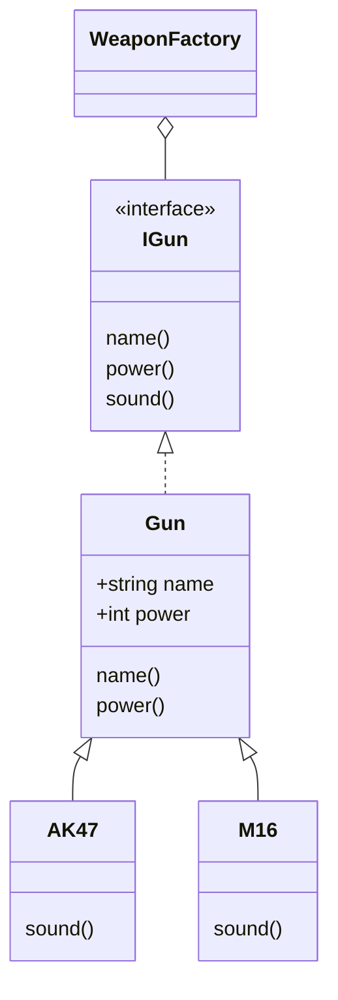
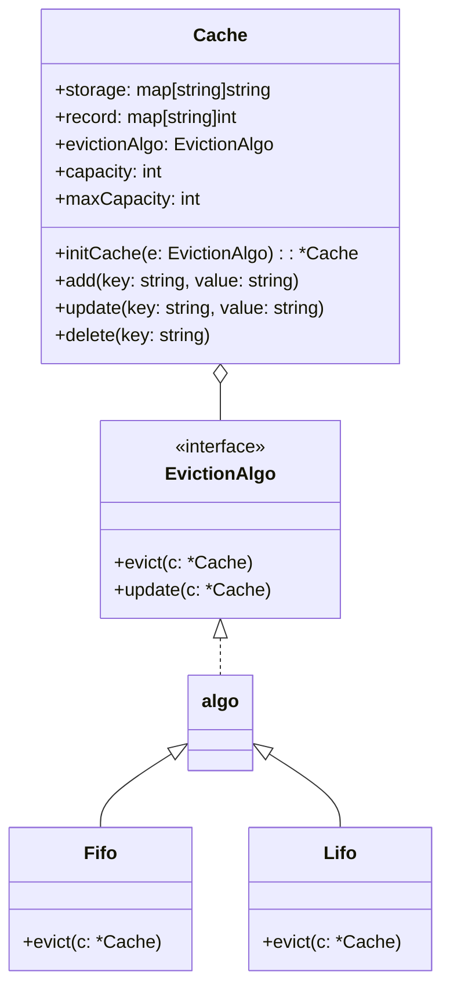

# Design Patterns

## 目錄

- strategy pattern - 策略模式
- factory pattern - 工廠模式

## reference

- `https://refactoring.guru/design-patterns`

## UML

Gun factory

```mermaid
classDiagram
   class Gun {
       +string name
       +int power
       name()
       power()
   }

   class IGun {
       <<interface>>
       name()
       power()
       sound()
   }

   class AK47 {
       sound()
   }

   class M16 {
       sound()
   }

   %% Gun relation
   IGun <|.. Gun
   Gun <|-- AK47
   Gun <|-- M16

   %% create IGun
   WeaponFactory o-- IGun
```

cache strategy

```mermaid
classDiagram
   class EvictionAlgo {
       <<interface>>
       +evict(c: *Cache)
       +update(c: *Cache)
   }

   class algo {
   }

   class Fifo {
       +evict(c: *Cache)
   }

   class Lifo {
       +evict(c: *Cache)
   }

   class Cache {
       +storage: map[string]string
       +record: map[string]int
       +evictionAlgo: EvictionAlgo
       +capacity: int
       +maxCapacity: int
       +initCache(e: EvictionAlgo): *Cache
       +add(key: string, value: string)
       +update(key: string, value: string)
       +delete(key: string)
   }

   EvictionAlgo <|.. algo
   algo <|-- Fifo
   algo <|-- Lifo
   Cache o-- EvictionAlgo
```